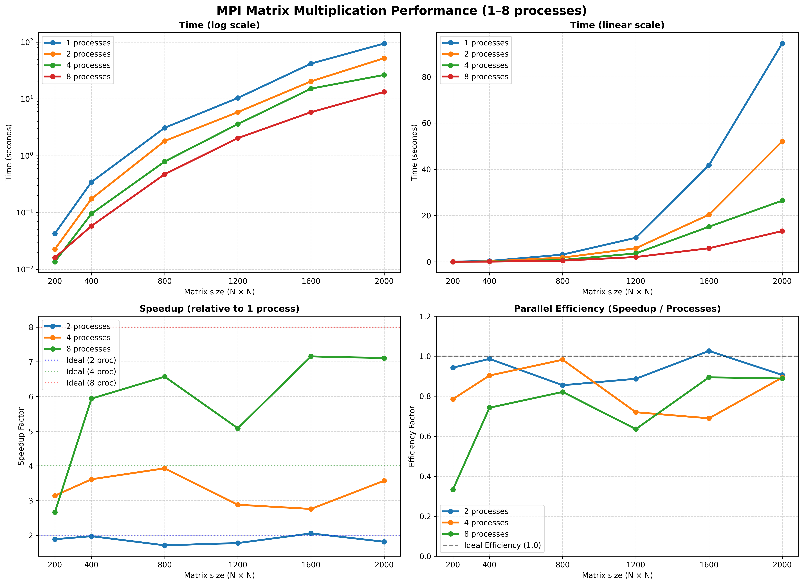

# Лабораторная работа: Параллельное перемножение матриц на MPI (C++)

В этой работе я сделал программу на C++ для параллельного умножения квадратных матриц. Чтобы делить вычисления между процессами (ядрами), используется технология MPI. Также написал два вспомогательных скрипта на Python: один генерирует случайные матрицы, а второй проверяет, правильно ли C++ всё посчитал (через библиотеку NumPy).

## 🛠️ Как всё устроено и из чего состоит проект

### 1. Генератор матриц (matrix_generator.py)
* Скрипт создаёт файлы со случайными числами.
* Ему через консоль передаются нужные размеры (строки, столбцы) и диапазон чисел (минимум и максимум).
* Чтобы файлы разных тестов не перезаписывали друг друга, в название файла подставляется размер матрицы (например, `matrix_400_1.txt`).

### 2. Главный код (main.cpp)
* `read_matrix()` — Считывает матрицы из файлов. Чтобы программа не зависала и процессы не конфликтовали при одновременном чтении, файлы читает только самый первый процесс (`rank 0`).
* `multiply_matrix()` — Функция, где происходит само умножение матриц.
* `run_single_test()` — Запускает один тест, засекает время работы через `std::chrono` и в конце вызывает Python-скрипт для проверки результатов.
* `log_result()` — Записывает полученное среднее время в текстовый файл `src/measurements.txt`, чтобы потом по нему строить графики.

### 3. Как работает параллельность в MPI
* Вся первая матрица делится по строкам между процессами. Я написал код так, что если размер матрицы не делится ровно на количество ядер, остаток строк распределяется автоматически, и программа не падает.
* Каждый процесс считает свою часть, переводит результат в одномерный массив (разворачивает его в строку) и отправляет обратно.
* Для сборки всех кусков обратно в одну большую матрицу на процессе `rank 0` используется функция `MPI_Gatherv`.

### 4. Скрипт проверки результатов (verification.py)
* Нужен для автоматической проверки. Он берёт те же исходные файлы, перемножает их встроенным в NumPy методом (через оператор `@`) и сравнивает с тем, что насчитал наш код на C++.
* Чтобы на больших матрицах числа не вылетали за границы, в Python принудительно используется тип `int64`. Если всё совпало, скрипт выводит `OK`, если нет — пишет `ERROR`.

---

## 📊 Результаты замеров времени

Тестировал на квадратных матрицах со случайными числами от -25 до 25. Каждый тест запускал по 3 раза, в таблицы записал среднее время.

### Время работы (в миллисекундах)

| Размер матрицы | 1 процесс | 2 процесса | 4 процесса | 8 процессов | Проверка (NumPy) |
| :--- | :---: | :---: | :---: | :---: | :---: |
| **200 x 200** | 42.79 мс | 22.70 мс | 13.62 мс | 16.06 мс | `Успешно (PASSED)` |
| **400 x 400** | 344.72 мс | 174.70 мс | 95.41 мс | 58.05 мс | `Успешно (PASSED)` |
| **800 x 800** | 3100.35 мс | 1813.39 мс | 789.07 мс | 471.81 мс | `Успешно (PASSED)` |
| **1200 x 1200** | 10372.90 мс | 5846.17 мс | 3602.15 мс | 2040.47 мс | `Успешно (PASSED)` |
| **1600 x 1600** | 41797.00 мс | 20362.60 мс | 15155.40 мс | 5841.39 мс | `Успешно (PASSED)` |
| **2000 x 2000** | 94404.80 мс | 52088.20 мс | 26434.80 мс | 13282.70 мс | `Успешно (PASSED)` |

### Во сколько раз быстрее (Ускорение)

| Размер матрицы | На 2 процессах | На 4 процессах | На 8 процессах |
| :--- | :---: | :---: | :---: |
| **200 x 200** | в 1.89 раз | в 3.14 раз | в 2.66 раз |
| **400 x 400** | в 1.97 раз | в 3.61 раз | в 5.94 раз |
| **800 x 800** | в 1.71 раз | в 3.93 раз | в 6.57 раз |
| **1200 x 1200** | в 1.77 раз | в 2.88 раз | в 5.08 раз |
| **1600 x 1600** | в 2.05 раз | в 2.76 раз | в 7.16 раз |
| **2000 x 2000** | в 1.81 раз | в 3.57 раз | в 7.11 раз |

---

## 🔍 Выводы по работе

1. **Маленькие матрицы параллелить нет смысла.** На размере 200х200 при запуске на 8 процессах время стало хуже, чем на 4 процессах (выросло с 13.62 до 16.06 мс). Так получается, потому что ядра тратят слишком много времени на пересылку сообщений и синхронизацию через MPI. На мелких задачах эти накладные расходы съедают весь выигрыш.
2. **На больших размерах параллельность работает отлично.** Чем больше матрица, тем заметнее польза от кучи ядер. На максимальном размере 2000х2000 программа на 8 процессах отработала почти в 7.1 раз быстрее, чем в один поток.
3. **Проблема с переполнением (обычный int не подошел).** Сначала тесты на больших матрицах (больше 400) выдавали ошибку верификации. Оказалось, что при умножении строк на столбцы итоговые суммы вылетали за лимит обычного 32-битного `int` (больше 2 миллиардов). Когда заменил типы на 64-битные (`long long` в C++ и `int64` в Python), баг ушел, и всё стало считаться правильно.

---

## 📈 Графики

По сохраненным логам построил графики времени работы, ускорения и эффективности:

