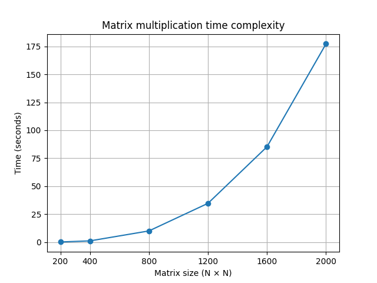

# Отчёт по лабораторной работе №1  
**Тема:** Последовательное перемножение матриц и исследование зависимости времени выполнения от размера

**Выполнил:** Роман Матушкин

---

## Цель работы
Разработать программу на языке C++ для перемножения матриц, измерить время выполнения для различных размеров матриц и исследовать зависимость времени от размера входных данных.

---

## Описание файлов проекта

### matrix_generator.py  
Скрипт для генерации случайных матриц заданного размера и записи их в текстовые файлы.  
Первая строка файла содержит размеры матрицы (rows cols), далее идут элементы матрицы построчно.

### main.cpp
Программа на C++, которая:
- считывает две матрицы из файлов
- выполняет их перемножение
- записывает результат в файл
- измеряет время выполнения функции умножения с помощью `chrono`

### matrix1.txt / matrix2.txt  
Входные файлы с исходными матрицами.

---

## Проведённые эксперименты

Эксперименты проводились для квадратных матриц размеров:

**200, 400, 800, 1200, 1600, 2000**

Каждый эксперимент выполнялся 3 раза для уменьшения случайной погрешности.

---

## Результаты экспериментов

| Размер матрицы | Время 1 (ms) | Время 2 (ms) | Время 3 (ms) | Среднее время (ms) |
| -------------- | ------------ | ------------ | ------------ | ------------------ |
| 200            | 143.388      | 135.308      | 138.709      | 139.135            |
| 400            | 1104.95      | 1115.18      | 1098.59      | 1106.24            |
| 800            | 9773.66      | 10202        | 10069.5      | 10015.053          |
| 1200           | 35127.6      | 34359        | 34538.8      | 34675.133          |
| 1600           | 81793.6      | 87635.6      | 86340.4      | 85256.533          |
| 2000           | 184532       | 167632       | 179656       | 177273.333         |

---

## Графическая визуализация

---

## Анализ результатов

Из полученных данных видно, что время выполнения алгоритма растёт существенно быстрее, чем линейно.

При увеличении размера матрицы:
- от 200 до 400 наблюдается рост примерно в 8 раз
- от 400 до 800 — ещё примерно в 8–9 раз
- далее рост становится ещё более выраженным

Это соответствует теоретической сложности алгоритма умножения матриц — **O(n³)**.

---

## Вывод

Реализован алгоритм умножения матриц и проведены замеры времени. Эксперименты показали, что с ростом размера матрицы время выполнения быстро увеличивается и соответствует сложности **O(n³)**. Для больших размеров целесообразно использовать оптимизации или параллельные вычисления.
